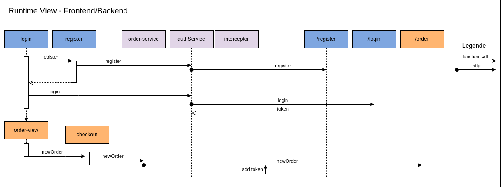
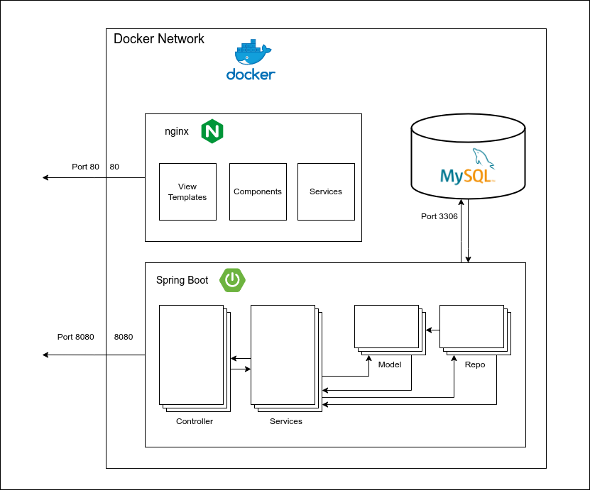
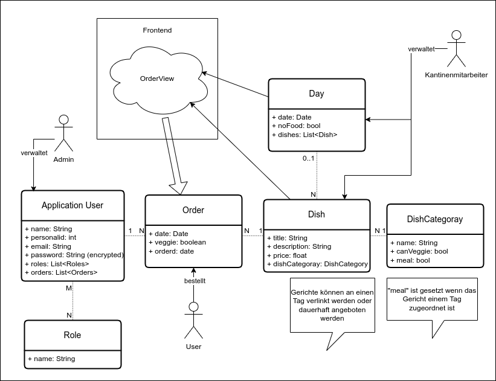

# Kantinerado

## Einführung und Ziele

Dieses Projekt ist ein Semesterprojekt, welches das Hauptziel hat, die in der Vorlesung gelernten Konzepte zur Software-Planung und Dokumentation umsetzen.

Hierzu soll eine Applikation erstellt und dokumentiert werden, mit der Mitarbeiter einer fiktiven Firma Essen in der Kantine einsehen und bestellen können mit einfacher Benutzerverwaltung. Dieses Dokument ist eine Architecture Dokumentation der gesamten Anwendung.

Diese Dokumentation umfasst die gesamte bisherige Entwicklung bis einschließlich Sprint 4 und hält sich stark an die arc42 Vorgaben.

## Table of Contents

1. [Stakeholder](#Stakeholder)
2. [Funktional requirements](#Funktional-requirements)
3. [Non Funktional Requirements](#NonFunktional-Requirements)
4. [Solution Strategy](#Solution-Strategy)
5. [Block View](#Block-View)
6. [Dynamic View](#Dynamic-View)
7. [Deployment](#Deployment)
8. [Crosscutting Concepts](#Crosscutting-Concepts)
9. [Architectural Decisions](#Architectural-Decisions)
11. [Risks and Technical Debt](#Risks-and-Technical-Debt)


## Stakeholder

Um Requirements für ein Projekt zu definiern sollte als erstes eine Stakeholder Analyse durchgefürht werden. Da das *Kantinerado* Projekt nur firmenintern genutzt werden soll, sind folglich auch alle Stakeholder firmenintern. Die nachfolgende Grafik zeigt eine Analyse aller beteiligten Stakeholder. Die Größe gibt dabei jeweils das Interesse der einzelnen Parteien am Gelingen des Projektes an.
\
\
\
\


## Funktional requirements:

1. **Benutzerregistrierung und Authentifizierung:**
   - Benutzer sollten sich registrieren können, um ein Konto zu erstellen und sich dann mit ihren Anmeldeinformationen anmelden können, um auf die App zuzugreifen.

2. **Produktkatalog anzeigen:**
   - Die App sollte eine übersichtliche Darstellung des verfügbaren Speiseangebots mit Preisen, Beschreibungen und ggf. Bildern anzeigen.

3. **Bestellungen aufgeben:**
   - Mitarbeiter sollten in der Lage sein, ihre Bestellungen aus dem Produktkatalog auszuwählen und hinzuzufügen, die Anzahl der Artikel anzugeben und die Bestellung abzuschließen. Bestellungen können als PDF ausgegben werden.

4. **Zahlungsoptionen (optional):**
   - Die App sollte verschiedene Zahlungsoptionen unterstützen, z. B. Kreditkarten, Debitkarten oder interne Abrechnungssysteme.

5. **Bestellverwaltung:**
   - Kantinenpersonal sollten in der Lage sein, Bestellungen übersichtlich einzusehen und zu Filtern. Zudem sollen Kantinenpersonal den Wöchentlichen Speiseplan zu verwalten und anzulegen.

6. **Benachrichtigungen:**
   - Benutzer sollten Benachrichtigungen über den Bestellstatus erhalten, z. B. wenn die Bestellung bestätigt wurde, wenn sie zur Abholung bereit ist oder wenn es Verzögerungen gibt.

7. **Verwaltung:**
    - Ein Admin Account kann Mitarbeiter und Kantinenpersonal Verwaltung. Dabei können Mitarbeiter auch zu Kantinenpersonal befördert/degradiert werden.
8. **Webanwendung:**
    - Das gesamte Projekt soll als Webanwendung umgesetzt werden.

9. **Historie**
    - Benutzer können eine History ihrer Bestellungen angezeigt bekommen. Sowohl für Veragende als auch Zukünftige.

## Non Funktional Requirements:

1. **Benutzerfreundlichkeit:**
   - Die App sollte eine intuitive Benutzeroberfläche haben, die einfach zu navigieren ist und auch von Mitarbeitern ohne technische Vorkenntnisse leicht verwendet werden kann.

2. **Sicherheit:**
   - Die App sollte Sicherheitsmechanismen wie HTTPS, sichere Authentifizierung und Datenverschlüsselung implementieren, um Benutzerdaten zu schützen.

3. **Leistung:**
   - Die App sollte eine schnelle Ladezeit haben und auch unter Last stabil und reaktionsschnell sein, um eine positive Benutzererfahrung zu gewährleisten.

4. **Skalierbarkeit:**
   - Die App sollte in der Lage sein, mit steigender Benutzerzahl und wachsendem Speiseangebot skalieren zu können, ohne dabei die Leistung zu beeinträchtigen.

5. **Kompatibilität:**
   - Die App sollte auf verschiedenen Geräten und Browsern korrekt funktionieren und eine konsistente Benutzererfahrung bieten.

6. **Barrierefreiheit:**
   - Die App sollte barrierefrei sein und die Web Content Accessibility Guidelines (WCAG) einhalten, um sicherzustellen, dass sie für alle Benutzer zugänglich ist, unabhängig von ihren Fähigkeiten oder Einschränkungen.

7. **Datenschutz und Compliance:**
   - Die App sollte den geltenden Datenschutzbestimmungen entsprechen und die Vertraulichkeit und Integrität der Benutzerdaten gewährleisten.

## Context und Scope

Hier abgebildet ist der Business Context. Dabei sind die drei Nutzergruppen und ihre Funktionen abgebildet. Welche Technischen Funktionen die einzelnen Rollen haben wird in der [Solution Strategy](#Solution-Strategy) ausführlich beschrieben.

<p align="center">
  
</p>

In der nachfolgenden Grafik ist der Systemkontext des Projekts dargestellt. Dieser hat bis auf die optionale Einbindung von externen Zahlungsanbieter keine direkten Abhängigkeiten zu anderen externen Systemen. Dies folgt vor allem daraus, dass diese Anwendung eigenständig innerhalb des Firmennetzes laufen soll. Die gesamte Bedienung des System erfolgt über einen beliebigen Browser und sommit dem *http*-Protokoll

<p align="center">
  
</p>

## Solution Strategy

### Technology

Zu beginn muss auf den voher definierten Anforderungen ein Tech-Stack erarbeitet werden, mit wechlem das Projket sinvoll umsetzbar ist. Dabei dürfen nicht nur die Anforderungen inbetracht gezogen werden, sondern auch die bekannten Technologien der enzelnen Entwickler. Da das Projekt als Webanwendung umgesetzt werden soll müssen für die drei zentralen Komponenten Technologien/Frameworks gefunden werden:

- Frontend
- Backend
- Datenbank

Als ein eher experimenteller Ansatz wurde zuerst eine erste Meinung zu den Technologien über eine KI eingeholt. Dadurch wird versucht, sich eine Durchschnittsmeinung zu erarbeiten und den jeweiligen Verbreitungsgrad der einzelnen Technologien. Die Angaben der KI wurden natürlich noch mit weiteren unabhängigen Quellen validiert. Der Ansatz stellte sich aber als erfolgreich heraus.

#### Frontend

| Kriterium                  | Gewichtung | React                    | Vue.js                   | Angular                  |
|----------------------------|------------|--------------------------|--------------------------|--------------------------|
| Lernkurve                  | 10%        | 7/10                     | 8/10                     | 6/10                     |
| Community-Support          | 15%        | 9/10                     | 8/10                     | 10/10                    |
| Entwickler-Tools           | 12%        | 8/10                     | 7/10                     | 9/10                     |
| Skalierbarkeit              | 15%        | 8/10                     | 8/10                     | 10/10                    |
| Performance                | 13%        | 9/10                     | 8/10                     | 10/10                    |
| Testing-Unterstützung      | 12%        | 8/10                     | 7/10                     | 9/10                     |
| Dokumentation              | 13%        | 9/10                     | 8/10                     | 10/10                    |
| Vorherige Erfahrung der Entwickler | 10% | 6/10                  | 3/10                     | 8/10                     |

**Gesamtbewertung (Punkte):**  
React: 7.6/10  
Vue.js: 7.45/10  
Angular: 8.8/10  

**Entscheidung:** Aufgrund der gewichteten Gesamtbewertung und der vorhandenen Erfahrung der Entwickler mit Angular wird sich für **Angular** entschieden.

#### Backend

| Kriterium                  | Gewichtung | Express.js               | Django                   | Ruby on Rails            | Java Spring Boot         |
|----------------------------|------------|--------------------------|--------------------------|--------------------------|--------------------------|
| Lernkurve                  | 10%        | 8/10                     | 7/10                     | 7/10                     | 6/10                     |
| Community-Support          | 15%        | 9/10                     | 8/10                     | 7/10                     | 8/10                     |
| Entwickler-Tools           | 12%        | 8/10                     | 9/10                     | 8/10                     | 9/10                     |
| Skalierbarkeit              | 15%        | 8/10                     | 9/10                     | 7/10                     | 9/10                     |
| Performance                | 13%        | 9/10                     | 8/10                     | 8/10                     | 8/10                     |
| Testing-Unterstützung      | 12%        | 8/10                     | 9/10                     | 8/10                     | 9/10                     |
| Dokumentation              | 13%        | 9/10                     | 8/10                     | 8/10                     | 8/10                     |
| Vorherige Erfahrung der Entwickler | 10% | 6/10                  | 7/10                     | 5/10                     | 9/10                     |

**Gesamtbewertung (Punkte):**  
Express.js: 7.85/10  
Django: 7.75/10  
Ruby on Rails: 7.35/10  
Java Spring Boot: 8.3/10  

**Entscheidung:** Aufgrund der gewichteten Gesamtbewertung und der vorhandenen Erfahrung der Entwickler wird sich für **Java Spring Boot** entschieden.


#### Datenbank


| Kriterium                  | Gewichtung | PostgreSQL              | MongoDB                  | MySQL                    |
|----------------------------|------------|-------------------------|--------------------------|--------------------------|
| Skalierbarkeit              | 20%        | 8/10                    | 9/10                     | 9/10                     |
| Datenmodell                | 15%        | 9/10                    | 7/10                     | 8/10                     |
| Abfrageleistung            | 15%        | 8/10                    | 7/10                     | 9/10                     |
| Verfügbarkeit und Ausfallsicherheit | 15% | 9/10                 | 7/10                     | 8/10                     |
| Erweiterbarkeit und Flexibilität | 10% | 8/10                  | 9/10                     | 8/10                     |
| Community und Support      | 10%        | 9/10                    | 8/10                     | 8/10                     |
| Sicherheit                  | 10%        | 9/10                   | 8/10                     | 8/10                     |
| Vorherige Erfahrung der Entwickler (nur bedingt wichtig, da Spring Boot als abstraktion dient) | 5% | 3/10                  | 2/10                     | 8/10                     |

**Gesamtbewertung (Punkte):**  
PostgreSQL: 7.5/10  
MongoDB: 6.8/10  
MySQL: 8.4/10  

**Entscheidung:** Aufgrund der gewichteten Gesamtbewertung und der vorhandenen Erfahrung der Entwickler wird sich für **MySQL** entschieden.

### Security

Für die Authentifikation und Autorisierung werden JWT-Token verwendet. Dabei soll es drei Rollen geben, welche unterschiedliche Berechtigungen haben sollen. Dabei sollen höhere Rollen auch auf Funktionen niedrieger Rollen zugreifen können (z.B. Admin kann auch normal Bestellen).

* Mitarbeiter: Normaler Mitarbeiter, welcher nur Gerichte bestellen kann
* Kantinenmitarbeiter: Nutzer mit dieser Rolle können Speisepläne verwalten und Bestellungen auswerten
* Admin: Kann alle Benutzer verwalten

Die Implementierung dieser Rollen sind in den nächsten Abschnitten näher beschrieben.

## Block View 

### Frontend

Zur Übersicht ist hier die statische Ansicht der einzelnen Komponenten im Frontend abgebildet. Da **Dependency injection** in Angular ein Kernkonzept ist, wird dieses verwendet, um Services einzubinden.

<p align="center">
  
</p>

### Backend

Für das Backend werden drei Verarbeitungslevel definiert, welche beim Entwicklen eingehalten werden müssen.

- Controller: Nehmen die Http anfragen entgegen und und senden am Ende richtige Inhlate und Statuscodes zurück.

- Services: Bekommen alle wichtigen Daten von einem Controller. Sind für die logische Verarbeitung einer Anfrage. hierunter fällt z.B. Die Validierung der Daten (Datum, ...). 

- Repositories: Bilden die von Springboot vorgegebene Schnittstelle zur Datenbank. Nur hier werden SQL Anfragen angelegt, wie von Springboot vorgegeben.

Diese Schichten sind durch Ordner getrennt, in denen die jeweiligen Java-Klassen liegen. Die Absicherung der einzelnen Routen findet mithilfe einer von Spring-Boot bereits vorgegebenen Security-chain statt. Diese unterstützt auch das beschriebene Rollensystem. Innerhalb der einzelnen Komponenten werden die Spring-Boot Annotation verwendet. Somit ist eine automatische **Dependency injection** der einzelnen Services- und Repositoryskomponenten möglich.

<p align="center">
  
</p>

In der Abbildung ist zur Vereinfachung nur die Order Komponente in den jeweiligen Schichten implementiert.


## Dynamic View

Diese Abildung zeigt die einzelnen Komponenten wie sie zur Laufzeit Interagieren. Die Grafik umfasst dabei nicht jede einzelne Komponente sondern nur die Bestellkomonente mit Servicen. Dies ist aber eqvivalent für alle andern Komonenten und Servicen zu betracheten.

Dieses Diagramm soll vorallem denn Ablauf des Login und der Registrieung zeigen und an welchem Punkt das Token angehängt wird. Dieses wird unabhänig von der Anfrage angehängt. Dies macht die Entwicklung einzelner Komponenten und Services einfacher, da sie sich nicht einzeln um das anhängen des Token kümmern müssen.

<p align="center">
  
</p>


## Deployment

Für das Deployen und Hosten der Software soll Docker verwendet werden. Dadurch ist es möglich, die vorher beschriebenen Komponenten in einzelne Container zu packen. Das Managen der Container erfolgt über eine Docker-compose. Dies vereinfacht auch das Verwalten der Container untereinander, da diese somit gleich in einem Network verwaltet werden. Auch ein zusätzlicher Sicherheitsaspekt wird dadurch hinzugefügt, da die Datenbank keine Verbindung nach außerhalb des Dockernetzwerkes hat. Damit alle Daten der Application einfach gesichert werden können, läuft die Datenbank mit einem extra Volume. Diese Hosting Solution macht es einfach die Anwendung auf beliebige Container-Infrastruktur zu deployen. Somit kann die Anwendung einfach in ein bestehendes Firmennetzwerk eingebunden werden.

Das bauen und Starten der Anwendung ist mit dem Docker-compose wrapper möglich

```
docker-compose build 
docker-compose up -d
```

Dabei wird auch ein autmoatische überprüft ob die Datenbank korrekt hochfährt bevor das Backend Zugriff erhält


<p align="center">
  
</p>

## Crosscutting Concepts

### Domain Model

Im folgenden ist das Domain Model beschrieben, welches aus den Anforderung hervorgeht. Es bildet alle notwendigen Verbindung und Entitäten ab. Die Schwäche dieses Modells ist zurzeit noch, das eine Bestellung eines Menüs aus dem Speiseplan mit dem Tag übereinstimmen muss. Logischerweise kann es nicht möglich sein, eine Bestellung für einen Tag aufzugeben, an dem das Gericht nicht angeboten wird. Daher muss hier eine Validierung in der Geschäftslogik geschehen, bzw. das Frontend sollte natürlich solche Anfragen auch nicht zulassen, aber durch die REST Full Architektur ist eine Validierung im Backend unumgänglich. Die Stärke dieses Modells soll sich später in der einfachen Auswertungen der Bestellungen und der zugeordneten Gerichte zeigen. 

Das System ist so gedacht das für die einzelnen Kategorien "Menü1", "Menü2", ... sowie für "Frühstück" eine "DishCategoray" erstellt wird. Dieses dynamische System erlaubt auch das einfache Erweitern das System. Denkbar ist z.b. auch das neue Menü, Specialdeals oder weitere feste Produkte eingebaut werden können, ohne dass die Datenstruktur erweitert werden muss. Zu besseren Versändis wurde auch auch noch gezeigt welche Entitäten für die Darstellung der Besstellansicht wichtig sind.


<p align="center">
  
</p>

### Security

Das JWT-Token garantiert im Backend, dass nur autorisierte Nutzer auch auf bestimmte Funktionen zugreifen können. Dies entlastet das Frontend. Hier sind zwar natürlich auch die einzelnen Rollen eingebaut. Ein mutwilliges Umgehen der Frontendmaßnahmen hätte denoch nur geringe Auswirkungen, da durch das Token, welches nicht manipuliert werden kann, eine maximale Sicherheit garantiert wird. Zwar könnte ein Angreifer im schlimmsten Fall sich die Ansichten (Routen) für höher privilegierte Nutzer anzeigen lassen, jedoch ohne Zugriff auf kritische Daten zu bekommen (falsches Token). Daher und da es hier sich um eine einfache Kantinen-App handelt, wird diese geringe Schwachstelle in Kauf genommen.

### User Interface 

Das User-Interface soll wie vorgegeben über eine Web-App zur Verfügung gestellt werden. Der Auswahl der Bestellung und das Bearbeiten des Speiseplan (auch Frühstück) soll tabellarisch erfolgen. Das generelle Design soll sich an "common practices" orientieren (Warenkorb oben rechts, etc.).


<p align="center">
  
</p>

### Testability/CI

Da im Backend die kritischen Funktionalitäten enthalten sind, sind für diese Unit-Tests anzulegen. Jeder Test muss dabei seine eigenen Testdaten anlegen. Das garantiert eine maximale Isolation der einzelnen Tests. Deshalb müssen Tests immer auf einer leeren Datenbank ausgeführt werden. Dem erfolgreichen Erstellen von Unit-Tests sind leider nicht alle Entwickler nachgekommen. Daher sollte ein Fokus in naher Zukunft auf die Testabdeckung gelegt werden.
Im Frontend sollte das Testen über Karmatests geschehen.

Die im Backend vorhanden Unit-Tests sowie ein Smoke-Test werden bei jedem Durchlauf der Pipeline ausgeführt.


## Architectural Decisions

Der groben Architektur der einzelnen Softwareteile wird teilweise stark durch die einzelnen Technologien vorgegeben. Das Backend ist als REST-API umgesetzt. Dies bietet vorallem den Vorteil das die Anwendung nicht zu komplex wird und sich besser Skalieren lässt. Aber auch das Testen wird somit einfacher. Die Schichtenarchitektur wird im Backend von Springboot mit vorgegebenen Annotationen bestens unterstützt. Desweitern eignet sich diese Architecture für das Projekt bestens, da viele Daten (Datum, etc.) im Backend aufwendiger validiert werden müssen. Dies kann mit der gewählten Architektur isoliert in der Serviceschicht  stattfinden. Auch wurden DTO Klassen eingeführt, welche genutzt werden, um den Datentyp der API Schnittstelle zu definieren. DTO Objekte bieten damit im Backend das Protokoll zwischen Controller und Service.

In Angular ist durch die Services und Komponenten eine grobe Struktur für den Aufbau vorgegeben. Hier wurde die Entscheidung getroffen, das API-Calls nur innerhalb von Services getätigt werden sollen. Dies vereinfacht das Debuggen und sorgt für eine bessere Codequalität. Interfaces werden genutzt, um zwischen den einzelnen Komponenten/Services zu kommunizieren.

## Risks and Technical Debt

Zum Schluss noch die unschöne Seite. Zuerst ist hier auf die hohe Anzahl an offenen Bugs hinzudeuten. Diese sind vor allem durch Nichteinhalten der DoD entstanden. Durch zu spätes Anfangen und demnach das zu späte Abschließen von Userstories konnte die Qualität nicht immer auf dem erwünschten Stand gehalten werden.

Zudem sind auch nicht alle erwünschten Features implementiert worden, welche für die 7 Sprints geplant wurden. Es fehlen Funktionen wie das Anpassen seines Profils. Die App bietet zwar gewisse Grundfunktionen ist aber nicht fertig. Vor allem muss aber hervorgehoben werden, dass durch die Domain Modellierung und die Implementierungen der Grundfunktionen eine sehr gute Grundlage geschaffen wurde auf welcher weitere Entwickeltung gut aufbauen kann.

Nach dieser Analyse ist zu sagen, dass das Projekt bei Weiterführung eine gute und realistische Chance hat, vollständig und fertig zu werden.
