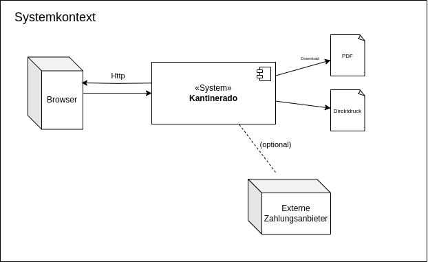

# Kantinerado

## Einführung und Ziele

## Stackholder

Um Requirements für ein Projekt zu definiern sollte als erstes eine Stakeholder Analyse durchgefürht werden. Da das *Kantinerado* Projekt nur firmenintern genutzt werden soll, sind folglich auch alle Stakeholder firmenintern. Die nachfolgende Grafik zeigt eine Analyse aller beteiligten Stakeholder. Die Größe gibt dabei jeweils das Interesse der einzelnen Parteien am Gelingen des Projektes an.
\
\
\
\

## Funktional requirements:

1. **Benutzerregistrierung und Authentifizierung:**
   - Benutzer sollten sich registrieren können, um ein Konto zu erstellen, und sich dann mit ihren Anmeldeinformationen anmelden können, um auf die App zuzugreifen.

2. **Produktkatalog anzeigen:**
   - Die App sollte eine übersichtliche Darstellung des verfügbaren Speiseangebots mit Preisen, Beschreibungen und ggf. Bildern anzeigen.

3. **Bestellungen aufgeben:**
   - Mitarbeiter sollten in der Lage sein, ihre Bestellungen aus dem Produktkatalog auszuwählen und hinzuzufügen, die Anzahl der Artikel anzugeben und die Bestellung abzuschließen.

4. **Zahlungsoptionen (optional):**
   - Die App sollte verschiedene Zahlungsoptionen unterstützen, z. B. Kreditkarten, Debitkarten oder interne Abrechnungssysteme.

5. **Bestellverwaltung:**
   - Kantinenpersonal sollten in der Lage sein, Bestellungen übersichtlich einzusehen und zu Filtern. Zudem sollen Kantinenpersonal den Wöchentlichen Speiseplan zu verwalten und anzulegen.

6. **Benachrichtigungen:**
   - Benutzer sollten Benachrichtigungen über den Bestellstatus erhalten, z. B. wenn die Bestellung bestätigt wurde, wenn sie zur Abholung bereit ist oder wenn es Verzögerungen gibt.

7. **Verwaltung:**
    - Ein Admin Account kann Mitarbeiter und Kantinenpersonal Verwaltung. Dabei können Mitarbeiter auch zu Kantinenpersonal befördert/degradiert werden.
8. **Webanwendung:**
    - Das gesamte Projekt soll als Webanwendung umgesetzt werden.

## Non Funktional Requirements:

1. **Benutzerfreundlichkeit:**
   - Die App sollte eine intuitive Benutzeroberfläche haben, die einfach zu navigieren ist und auch von Mitarbeitern ohne technische Vorkenntnisse leicht verwendet werden kann.

2. **Sicherheit:**
   - Die App sollte Sicherheitsmechanismen wie HTTPS, sichere Authentifizierung und Datenverschlüsselung implementieren, um Benutzerdaten zu schützen.

3. **Leistung:**
   - Die App sollte eine schnelle Ladezeit haben und auch unter Last stabil und reaktionsschnell sein, um eine positive Benutzererfahrung zu gewährleisten.

4. **Skalierbarkeit:**
   - Die App sollte in der Lage sein, mit steigender Benutzerzahl und wachsendem Speiseangebot skalieren zu können, ohne dabei die Leistung zu beeinträchtigen.

5. **Kompatibilität:**
   - Die App sollte auf verschiedenen Geräten und Browsern korrekt funktionieren und eine konsistente Benutzererfahrung bieten.

6. **Barrierefreiheit:**
   - Die App sollte barrierefrei sein und die Web Content Accessibility Guidelines (WCAG) einhalten, um sicherzustellen, dass sie für alle Benutzer zugänglich ist, unabhängig von ihren Fähigkeiten oder Einschränkungen.

7. **Datenschutz und Compliance:**
   - Die App sollte den geltenden Datenschutzbestimmungen entsprechen und die Vertraulichkeit und Integrität der Benutzerdaten gewährleisten.

## Context und Scope

In der nachfolgenden Grafik ist der Systemkontext des Projekts dargestellt. Dieser hat bis auf die optionale Einbindung von externen Zahlungsanbieter keine direkten Abhängigkeiten zu anderen externen Systemen. Dies folgt vor allem daraus, dass diese Anwendung eigenständig innerhalb des Firmennetzes laufen soll. Die gesamte Bedienung des System erfolgt über einen beliebigen Browser und sommit dem *http*-Protokoll
\
\
\

## Solution Strategy

### Technology

Zu beginn muss auf den voher definierten Anforderungen ein Tech-Stack erarbeitet werden, mit wechlem das Projket sinvoll umsetzbar ist. Dabei dürfen nicht nur die Anforderungen inbetracht gezogen werden, sondern auch die bekannten Technologien der enzelnen Entwickler. Da das Projekt als Webanwendung umgesetzt werden soll müssen für die drei zentralen Komponenten Technologien/Frameworks gefunden werden:

- Frontend
- Backend
- Datenbank

Als ein eher experimenteller Ansatz wurde zuerst eine erste Meinung zu den Technologien über eine KI eingeholt. Dadurch wird versucht, sich eine Durchschnittsmeinung zu erarbeiten. Die Angaben der KI wurden natürlich noch mit weiteren unabhängigen Quellen validiert. Der Ansatz stellte sich damit als erfolgreich heraus.

#### Frontend

| Kriterium                  | Gewichtung | React                    | Vue.js                   | Angular                  |
|----------------------------|------------|--------------------------|--------------------------|--------------------------|
| Lernkurve                  | 10%        | 7/10                     | 8/10                     | 6/10                     |
| Community-Support          | 15%        | 9/10                     | 8/10                     | 10/10                    |
| Entwickler-Tools           | 12%        | 8/10                     | 7/10                     | 9/10                     |
| Skalierbarkeit              | 15%        | 8/10                     | 8/10                     | 10/10                    |
| Performance                | 13%        | 9/10                     | 8/10                     | 10/10                    |
| Testing-Unterstützung      | 12%        | 8/10                     | 7/10                     | 9/10                     |
| Dokumentation              | 13%        | 9/10                     | 8/10                     | 10/10                    |
| Vorherige Erfahrung der Entwickler | 10% | 6/10                  | 3/10                     | 8/10                     |

**Gesamtbewertung (Punkte):**  
React: 7.6/10  
Vue.js: 7.45/10  
Angular: 8.8/10  

**Entscheidung:** Aufgrund der gewichteten Gesamtbewertung und der vorhandenen Erfahrung der Entwickler mit Angular wird sich für **Angular** entschieden.

#### Backend

| Kriterium                  | Gewichtung | Express.js               | Django                   | Ruby on Rails            | Java Spring Boot         |
|----------------------------|------------|--------------------------|--------------------------|--------------------------|--------------------------|
| Lernkurve                  | 10%        | 8/10                     | 7/10                     | 7/10                     | 6/10                     |
| Community-Support          | 15%        | 9/10                     | 8/10                     | 7/10                     | 8/10                     |
| Entwickler-Tools           | 12%        | 8/10                     | 9/10                     | 8/10                     | 9/10                     |
| Skalierbarkeit              | 15%        | 8/10                     | 9/10                     | 7/10                     | 9/10                     |
| Performance                | 13%        | 9/10                     | 8/10                     | 8/10                     | 8/10                     |
| Testing-Unterstützung      | 12%        | 8/10                     | 9/10                     | 8/10                     | 9/10                     |
| Dokumentation              | 13%        | 9/10                     | 8/10                     | 8/10                     | 8/10                     |
| Vorherige Erfahrung der Entwickler | 10% | 6/10                  | 7/10                     | 5/10                     | 9/10                     |

**Gesamtbewertung (Punkte):**  
Express.js: 7.85/10  
Django: 7.75/10  
Ruby on Rails: 7.35/10  
Java Spring Boot: 8.3/10  

**Entscheidung:** Aufgrund der gewichteten Gesamtbewertung und der vorhandenen Erfahrung der Entwickler wird sich für **Java Spring Boot** entschieden.

#### Datenbank

| Kriterium                  | Gewichtung | PostgreSQL              | MongoDB                  | MySQL                    |
|----------------------------|------------|-------------------------|--------------------------|--------------------------|
| Skalierbarkeit              | 20%        | 8/10                    | 9/10                     | 9/10                     |
| Datenmodell                | 15%        | 9/10                    | 7/10                     | 8/10                     |
| Abfrageleistung            | 15%        | 8/10                    | 7/10                     | 9/10                     |
| Verfügbarkeit und Ausfallsicherheit | 15% | 9/10                 | 7/10                     | 8/10                     |
| Erweiterbarkeit und Flexibilität | 10% | 8/10                  | 9/10                     | 8/10                     |
| Community und Support      | 10%        | 9/10                    | 8/10                     | 8/10                     |
| Sicherheit                  | 10%        | 9/10                   | 8/10                     | 8/10                     |
| Vorherige Erfahrung der Entwickler (nur bedingt wichtig, da Spring Boot als abstraktion dient) | 5% | 3/10                  | 2/10                     | 8/10                     |

**Gesamtbewertung (Punkte):**  
PostgreSQL: 7.5/10  
MongoDB: 6.8/10  
MySQL: 8.4/10  

**Entscheidung:** Aufgrund der gewichteten Gesamtbewertung und der vorhandenen Erfahrung der Entwickler wird sich für **MySQL** entschieden.
 
### Architecture Overview

Für das Deployen und Hosten der Software soll Docker verwendet werden. Dadurch ist es möglich, die vorher beschriebenen Komponenten in einzelne Container zu packen. Das Managen der Container soll über eine Docker-compose erfolgen. Dies vereinfacht auch das Verwalten der Container untereinander, da diese somit gleich in einem Network verwaltet werden.

  

### Entity Overview

Erster Entwurf für die Modellierung der Datenstruktur um Backend. Dieser beachtet, dass es tägliche Menüs und Zusatzspeisen gibt sowie Frühstücksangebote, welche jeden Tag angeboten werden. Die Schwäche dieses Modells ist zurzeit noch, das eine Bestellung eines Menüs aus dem Speiseplan mit dem Tag übereinstimmen muss. Logischerweise kann es nicht möglich sein, eine Bestellung für einen Tag aufzugeben, an dem das Gericht nicht angeboten wird. Daher muss hier eine Validierung in der Geschäftslogik geschehen, bzw. das Frontend sollte natürlich solche Anfragen auch nicht zulassen, aber durch die REST Full Architektur ist eine Validierung im Backend unumgänglich (die gestrichelte Linie stellt diese Validierung dar). Die Stärke dieses Modells soll sich später in der einfachen Auswertungen der Bestellungen und der zugeordneten Gerichte zeigen. Auch die Mealplan Entity vereinfacht das Abfragen des Speiseplans für eine bestimmte Woche.

Das System ist so gedacht das für die einzelnen Kategorien "Menü1", "Menü2", ... sowie für "Frühstück" eine "DishCategoray" erstellt wird. Dieses dynamische System erlaubt auch das einfache Erweitern das System. Denkbar ist z.b. auch das neue Menü, Special Deals oder weitere feste Produkte eingebaut werden können, ohne dass die Datenstruktur erweitert werden muss. Zu besseren Versändis wurde auch auch noch gezeigt welche Entitäten für die Darstellung der Besstellansicht wichtig sind.

  

 